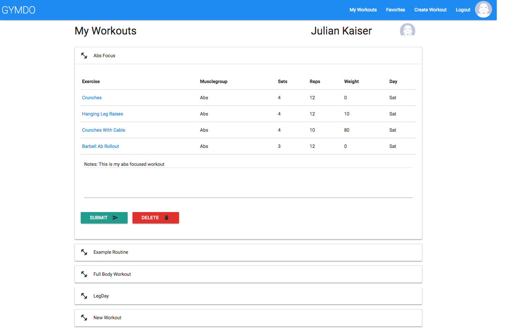

# Gymdo Workout App

## Summary
This website is a single-page application made with React. The main goal of this app is to enable users to create their own workout routine and keep themselves informed about certain exercises.

## Tech Stack
* React.js and Redux
* Express.js on Node.js
* PostgreSQL Database
* Webpack as a module bundler
* Usage of wger Workout Manager REST API for exercise data

## Features
* The website includes user registration and user login as well as logout.
* Users can create their own workout plan.
* Big selection of exercises (API calls based on chosen muscle group).
* Overview of all created workouts, ability to add notes or delete workout entirely.
* Exercise detail page with more description content.
* Users can like exercises and save them for later review.

****

****

****

****

****

****

